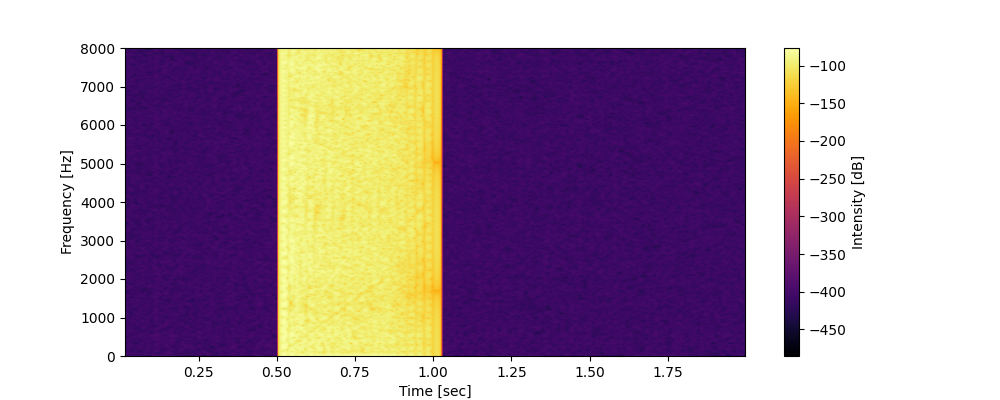
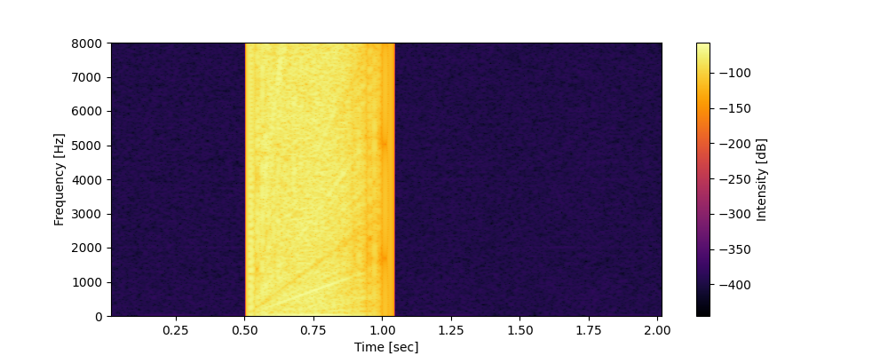
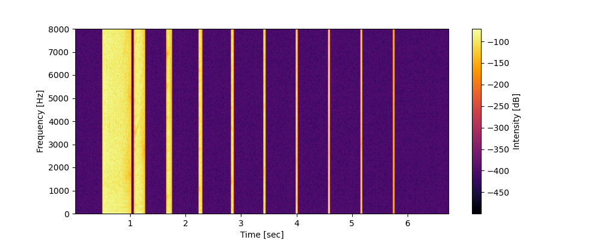

# Audio Reverberation Simulation

## Overview

2 次元と 3 次元空間での音響シミュレーションを行う Python プログラム

## Usage

`commands.ps1`を実行することで、2 次元と 3 次元（Z 軸が 10 と 100 ）でのシミュレーションが行われます。

```powershell
./commands.ps1
```

## Important Notes

* `energy_absorption=0.0` とすると、反響が非常に多くなります。
* `max_order` を17以下に設定することで、計算時間を抑制します。

## Experimental Results

### 2D Simulation



### 3D Simulation with Z=10



### 3D Simulation with Z=100



## Discussion

* 3 次元空間でのシミュレーションでは、反響の最後に高い周波数成分が残る傾向
* しかし、部屋の長さ（Z 軸）を 100 にすると、この現象は起こらなかった
* この特性は 2 次元空間でのシミュレーションと同様
* したがって、高い周波数の成分は横方向の壁が存在することで生じる
